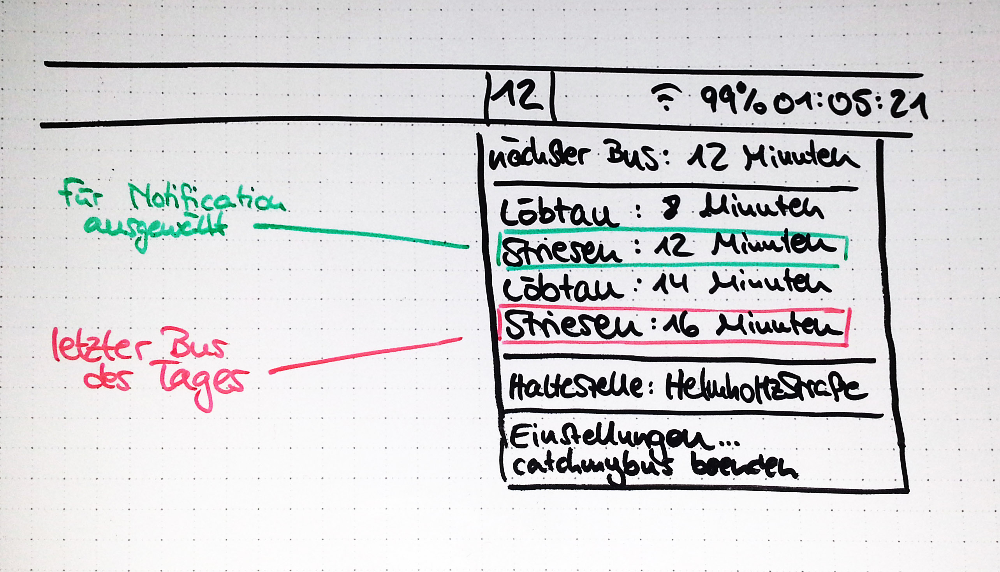

#catchmybus

A simple little app that lives in the Mac's menubar and displays when the next bus or tram leaves the stop you specify (in Dresden, Germany).

Name shamelessly stolen from [hoodie/catch-my-bus](https://github.com/hoodie/catch-my-bus).

Not even close to being anywhere yet, but this is an idea as to where it's headed:

