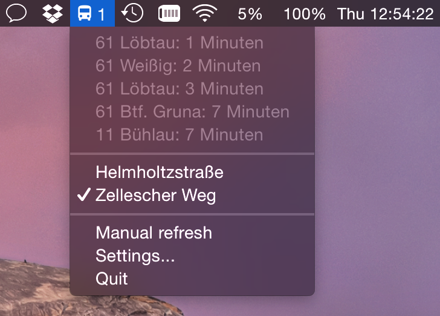

#### The code in this repo is currently not functional nor is it something I'm proud of. This was the first thing I've ever written in Swift and that's what it feels like. The latest release works fine (if you don't care about switching stops yet), but that's about it. I will be coming back to this sometime in the future and (hopefully) make it nice. But until that happens, please don't judge me by anything that you can see here 🙃
##### P.S. This app uses [Sparkle](http://sparkle-project.org) to update. So as long as you either watch this repo and/or start the app every now and then you'll definitely get notified once something happens. Otherwise this is still just a tiny little almost useless utility, I probably shouldn't be taking this so seriously^^

#catchmybus

A simple little app that lives in the Mac's menubar and displays when the next bus or tram leaves the stop you specify (in Dresden, Germany).
You can also choose a specific bus or tram to be notified about when it's getting close.

The selection of custom stops is unfortunately not possible quite yet.

Runs on OS X 10.10+.

## Download

Click [here](https://github.com/kiliankoe/catchmybus/releases/latest) for the latest release.

## Screenshot

## Compiling

You'll need at least OS X 10.10 (oh-ess-ten-ten-ten), Xcode and Cocoapods. 

- Clone this project
- Run `pod install` in the project directory
- Open `catchmybus.xcworkspace` in Xcode
- Press Run

That didn't work? Please [tell me](https://github.com/kiliankoe/catchmybus/issues/new) about it.

## Credits

Name and idea shamelessly stolen from [hoodie/catch-my-bus](https://github.com/hoodie/catch-my-bus).

There's a very similar version to catchmybus built with Python and GTK if you're looking for something that will run on other systems. Check that out here: [devmeepo/catch-my-bus-python](https://github.com/devmeepo/catch-my-bus-python).
