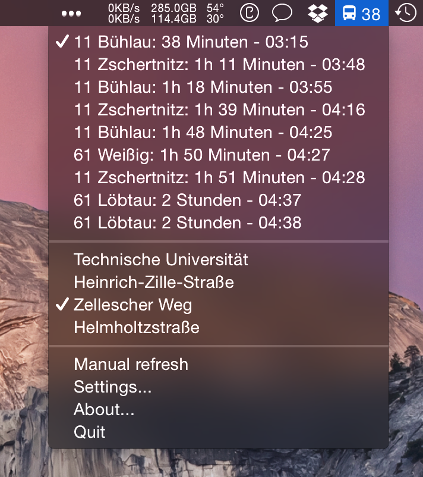
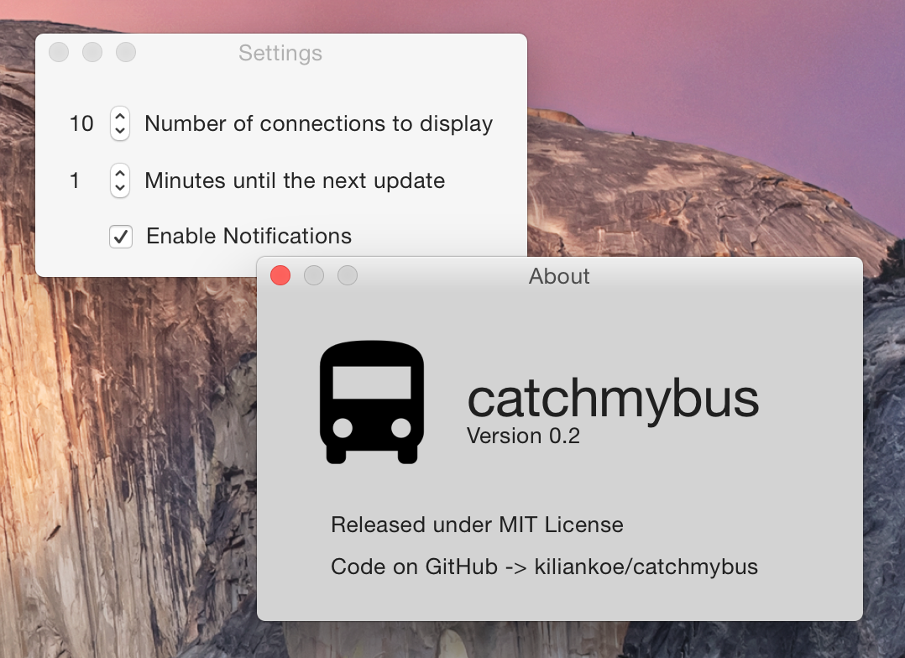

#catchmybus

A simple little app that lives in the Mac's menubar and displays when the next bus or tram leaves the stop you specify (in Dresden, Germany).
You can also choose a specific bus or tram to be notified about when it's getting close.

The selection of custom stops is unfortunately not possible quite yet. It's coming :blush:

Runs on OS X 10.9 Mavericks and 10.10 Yosemite.

## Download

Check the [releases](https://github.com/kiliankoe/catchmybus/releases) page for downloading the most current version.

## Screenshots

## Compiling

You'll need a Mac running OS X 10.10 Yosemite as it's unfortunately not possible to build Swift apps on anything below. You'll still be able to run the app on Mavericks though. Check the [releases](https://github.com/kiliankoe/catchmybus/releases) page.

## Credits

Name and idea shamelessly stolen from [hoodie/catch-my-bus](https://github.com/hoodie/catch-my-bus).
