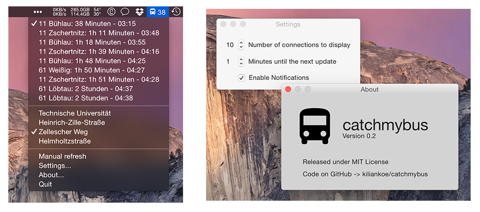

#catchmybus

A simple little app that lives in the Mac's menubar and displays when the next bus or tram leaves the stop you specify (in Dresden, Germany).

### Compiling

You'll need a Mac running OS X 10.10 Yosemite as it's unfortunately not possible to build Swift apps for anything below. What a shame.

Be sure to also check out [Alamofire](https://github.com/alamofire/alamofire) (or clone it to the project directory manually) as this fantastic framework is used for the HTTP requests.

### Screenshot

Not even close to being finished, but this is an idea as to where it's headed:

Name shamelessly stolen from [hoodie/catch-my-bus](https://github.com/hoodie/catch-my-bus).
